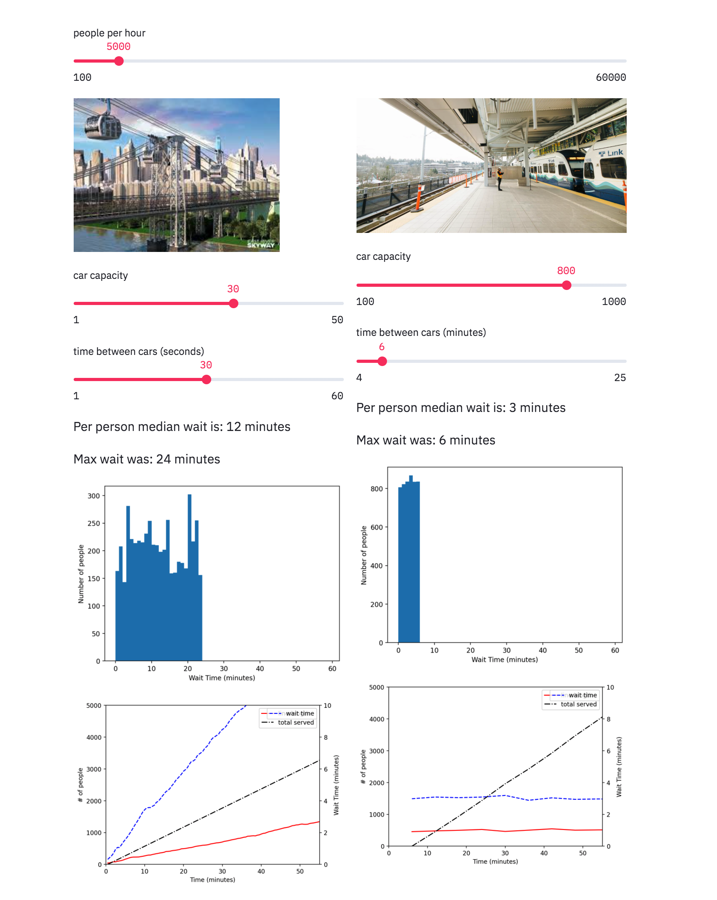

# TransitChooser



To run this locally, clone this repo and then do the following.


```cd TransitChooser
# I recommend using conda but feel free to not.
conda create --name transit_chooser python=3.7
conda activate transit_chooser
pip install -r requirements.txt
streamlit run main.py```
